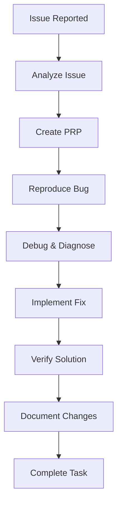

# Enhanced Context Engineering Framework - Workflow Guide

## Table of Contents
1. [Getting Started](#getting-started)
2. [Core Workflows](#core-workflows)
3. [Command Usage](#command-usage)
4. [Best Practices](#best-practices)
5. [Advanced Techniques](#advanced-techniques)

## Getting Started

### Initial Setup
1. Clone the repository
2. Run setup script: `./setup.sh`
3. Configure your AI assistant with custom namespace
4. Verify installation with test commands

### Framework Philosophy
The Enhanced Context Engineering Framework follows a systematic 7-step methodology:
1. **Understand** - Comprehensive problem analysis
2. **Explore** - Systematic codebase investigation
3. **Reproduce** - Baseline establishment and validation
4. **Debug** - Root cause identification
5. **Develop** - Targeted implementation
6. **Verify** - Rigorous testing and validation
7. **Document** - Knowledge capture and transfer

## Core Workflows

### Bug Resolution Workflow


#### Step-by-Step Process
1. **Start Session**
   ```
   /project:enhanced-context:session-start
   ```

2. **Analyze Issue**
   ```
   /project:enhanced-context:analyze-issue [issue-description]
   ```

3. **Generate PRP**
   ```
   /project:enhanced-context:generate-enhanced-prp [issue-id]
   ```

4. **Execute PRP**
   ```
   /project:enhanced-context:execute-enhanced-prp
   ```

5. **Quality Review**
   ```
   /project:enhanced-context:quality-review
   ```

6. **Complete Task**
   ```
   /project:enhanced-context:task-complete
   ```

### Feature Development Workflow
1. **Requirements Analysis**
   - Use deep-research for background
   - Document specifications in PRP
   - Identify integration points

2. **Design Phase**
   - Pattern analysis for consistency
   - Architecture documentation
   - Test planning

3. **Implementation**
   - Incremental development
   - Continuous testing
   - Regular checkpoints

4. **Validation**
   - Comprehensive testing
   - Performance verification
   - Security audit

### Research Workflow
1. **Define Research Scope**
   ```
   /project:enhanced-context:deep-research "topic or question"
   ```

2. **Documentation Scan**
   ```
   /project:enhanced-context:documentation-scan
   ```

3. **Pattern Analysis**
   ```
   /project:enhanced-context:pattern-analysis
   ```

4. **Synthesize Findings**
   - Compile research results
   - Create summary documentation
   - Identify actionable insights

## Command Usage

### Development Commands
#### analyze-issue
Performs structured analysis of reported issues.
```
/project:enhanced-context:analyze-issue "User authentication fails with JWT tokens"
```

#### implement-feature
Systematic feature implementation with full lifecycle.
```
/project:enhanced-context:implement-feature "Add OAuth2 support"
```

#### quality-review
Multi-level quality assurance review.
```
/project:enhanced-context:quality-review --comprehensive
```

### Research Commands
#### deep-research
Comprehensive investigation of topics.
```
/project:enhanced-context:deep-research "Performance optimization techniques"
```

#### pattern-analysis
Identifies patterns in codebase.
```
/project:enhanced-context:pattern-analysis --focus "error-handling"
```

### Validation Commands
#### comprehensive-test
Executes 6-level testing protocol.
```
/project:enhanced-context:comprehensive-test
```

#### security-audit
Performs security validation.
```
/project:enhanced-context:security-audit --owasp-top-10
```

### Workflow Commands
#### checkpoint
Creates progress checkpoint.
```
/project:enhanced-context:checkpoint "Completed authentication module"
```

## Best Practices

### Session Management
1. **Always Start with Context**
   - Run session-start at beginning
   - Review existing PRPs
   - Check task status

2. **Regular Checkpoints**
   - Save progress frequently
   - Document decisions
   - Update task tracking

3. **Clean Session End**
   - Complete all validations
   - Update documentation
   - Archive PRPs

### Problem Resolution
1. **Never Skip Reproduction**
   - Always create reproduction script
   - Verify consistently reproducible
   - Document edge cases

2. **Incremental Changes**
   - Small, focused commits
   - Test after each change
   - Maintain working state

3. **Comprehensive Testing**
   - Unit tests for all changes
   - Integration test coverage
   - Performance validation

### Documentation Standards
1. **Real-time Documentation**
   - Document as you work
   - Capture decision rationale
   - Update affected docs

2. **Knowledge Transfer**
   - Clear summaries
   - Reproducible examples
   - Lessons learned

## Advanced Techniques

### Sequential Thinking Integration
Use sequential thinking for complex problems:
```python
# Set appropriate thought depth
thoughts = 15  # for moderate complexity

# Use branching for alternatives
branch_on_uncertainty = True

# Question previous assumptions
allow_revisions = True
```

### Multi-Command Workflows
Combine commands for powerful workflows:
```bash
# Research → Analyze → Implement
/project:enhanced-context:deep-research "authentication patterns"
/project:enhanced-context:pattern-analysis --focus "auth"
/project:enhanced-context:implement-feature "enhanced authentication"
```

### Quality Gate Automation
```bash
# Run all quality checks
/project:enhanced-context:comprehensive-test && \
/project:enhanced-context:security-audit && \
/project:enhanced-context:quality-review
```

### PRP-Driven Development
1. **Generate Detailed PRP**
   - Include all research findings
   - Document multiple approaches
   - Define clear success criteria

2. **Execute with Monitoring**
   - Track progress against PRP
   - Adjust based on findings
   - Document deviations

3. **Validate Against PRP**
   - Ensure all criteria met
   - Verify risk mitigations
   - Complete all checklist items

## Troubleshooting Integration

### Common Issues
1. **Command Not Found**
   - Verify namespace configuration
   - Check command file exists
   - Validate syntax

2. **Incomplete Execution**
   - Review quality gates
   - Check error logs
   - Verify prerequisites

3. **Quality Gate Failures**
   - Run individual validations
   - Review specific failures
   - Address systematically

### Performance Optimization
1. **Use Appropriate Tools**
   - Grep for pattern search
   - LS for structure understanding
   - Read for detailed examination

2. **Batch Operations**
   - Group related commands
   - Use shell scripts for repetitive tasks
   - Leverage parallel execution

3. **Cache Research Results**
   - Store findings in PRPs
   - Reference previous research
   - Build knowledge base

## Workflow Examples

### Example 1: Critical Bug Fix
```bash
# 1. Emergency session start
/project:enhanced-context:session-start --priority critical

# 2. Quick analysis
/project:enhanced-context:analyze-issue "Production API returning 500 errors"

# 3. Fast reproduction
# Create minimal test case
# Verify in isolated environment

# 4. Targeted fix
/project:enhanced-context:implement-feature --minimal-change

# 5. Rapid validation
/project:enhanced-context:comprehensive-test --focus api

# 6. Deploy preparation
/project:enhanced-context:task-complete --expedited
```

### Example 2: Feature Research and Implementation
```bash
# 1. Research phase
/project:enhanced-context:deep-research "microservices communication patterns"
/project:enhanced-context:documentation-scan --external
/project:enhanced-context:pattern-analysis --industry-standards

# 2. Design phase
/project:enhanced-context:generate-enhanced-prp "implement service mesh"

# 3. Implementation
/project:enhanced-context:execute-enhanced-prp --phased

# 4. Validation
/project:enhanced-context:comprehensive-test
/project:enhanced-context:security-audit
/project:enhanced-context:quality-review --architectural
```

## Integration Tips

### With Version Control
```bash
# Before starting work
git checkout -b feature/enhanced-context-task

# Regular commits during workflow
git commit -m "ECF: Complete reproduction phase"

# After task completion
git push origin feature/enhanced-context-task
```

### With CI/CD
```yaml
# .github/workflows/ecf-validation.yml
- name: ECF Quality Gates
  run: |
    ./ecf-validate.sh
    /project:enhanced-context:comprehensive-test
```

### With Project Management
- Link PRPs to issues
- Update status in PM tools
- Export metrics for reporting

## Summary
The Enhanced Context Engineering Framework provides a systematic approach to software engineering tasks. By following these workflows and best practices, you ensure high-quality, well-tested, and properly documented solutions. Remember: the methodology saves time by preventing rework and ensures robust solutions.